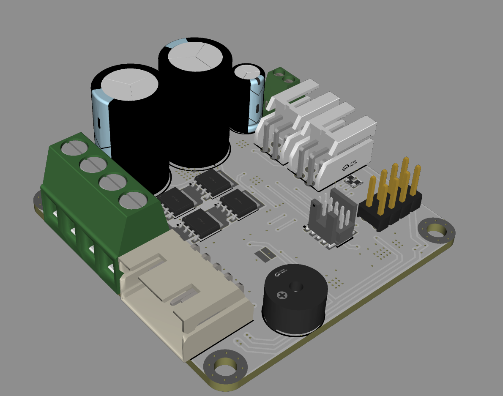
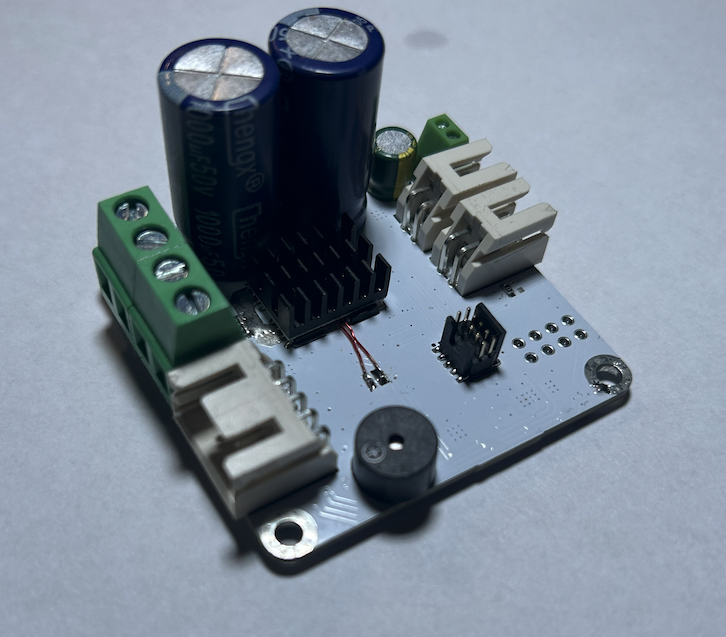

# BDC Driver

&nbsp;

  
&nbsp; &nbsp; &nbsp; &nbsp;
  

## Overview

Compact brushed DC motor driver with RS485 (Modbus) / CAN control, based on the **STM32G0B1CBT6** MCU.

### Key Features

- **A4955** as the main gate driver (up to 50V)  
- **LMR51635** step-down converter for 5V rail  
- **CAN/RS485 transceiver** using a shared footprint (selected via jumpers)  
- **Encoder/endstop/motor thermistor connector** supporting:
  - SPI
  - I2C
  - Incremental encoders  
    _(Currently, only incremental encoders are implemented; support for other types can be added by modifying `enc.c`)_
- **Bootloader** with software update capability  
- **AUX output**, **buzzer**, and additional **GPIO header**  
- **Monitoring** of:
  - Input voltage
  - H-bridge temperature
  - Motor temperature  

---

## Software

The current software revision is in a **Proof-of-Concept (PoC)** state. Motor control is implemented using a simple **PID algorithm**.

### Supported Control Modes

- **Position Mode** – Motor moves to the requested position  
- **Velocity Mode** – Motor maintains a set speed  
- **Dumb Mode** – Simple open-loop control  

> 💡 Currently, only RS485 communication and bootloader are implemented. CAN support may be added if needed in the future.

---

## RS485 Firmware Update Process

Using the `otw-modbus.py` script, update over RS485 Modbus is performed as follows:

1. Write `1` to **coil 1000** to switch to bootloader mode  
2. Write the **flash page number** into **register 40000**  
3. Write a **2KB flash page** into **registers starting from 41000**  
4. Check if the **CRC** for the flash page matches by reading **register 30000**  
5. Repeat steps 2–4 until all flash pages are written  
6. After all pages are sent, write `1` into **register 1001** to perform the update  
7. Verify if the device successfully booted into the application by reading **register 1000**  
8. If successful, validate the update by writing `1` into **register 1002**  

---

## Hardware

Soon on OSHW Lab